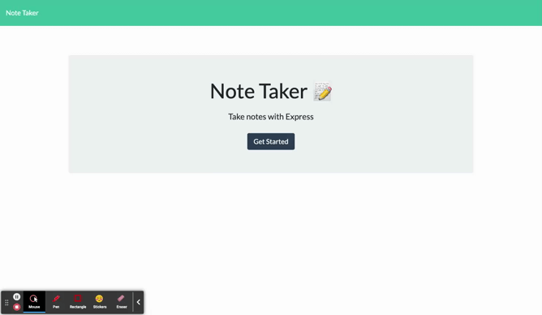

# Note Taker

## Purpose
AS A small business owner
I WANT to be able to write and save notes
SO THAT I can organize my thoughts and keep track of tasks I need to complete

## Table of Contents
- [Purpose](#purpose) 
- [Description](#description) 
- [Installation Instructions](#installation-instructions)
- [Process](#process)
- [Demo Preview](#demo-preview)
- [Github Repository](#github-repository)
- [Heroku Repository](#heroku-repository)

## Description
GIVEN a note-taking application
WHEN I open the Note Taker
THEN I am presented with a landing page with a link to a notes page
WHEN I click on the link to the notes page
THEN I am presented with a page with existing notes listed in the left-hand column, plus empty fields to enter a new note title and the note’s text in the right-hand column
WHEN I enter a new note title and the note’s text
THEN a Save icon appears in the navigation at the top of the page
WHEN I click on the Save icon
THEN the new note I have entered is saved and appears in the left-hand column with the other existing notes
WHEN I click on an existing note in the list in the left-hand column
THEN that note appears in the right-hand column
WHEN I click on the Write icon in the navigation at the top of the page
THEN I am presented with empty fields to enter a new note title and the note’s text in the right-hand column

## Installation Instructions  
Go to the github repo provided below and download the code. Make sure to run 'npm install express uuid'. Then run 'npm start'. 
The console log will let you know the hhtp://localhost:3001 is ready to be used in a web browser and or insomnia. 
From there feel free to make notes, save and delete as you please. 

## Process
Cloned the starter code. I was expecting it to be much more similar to zookeepr *module work*, so I set up the code from that activity to get started. 
I was WRONG and overcomplicated it for myself. After meeting with my tutor, I realized it would be a much simpler structure and I did not needs tests, library, multiple route folders, etc. Once I cleaned up the structure, I found the router was not as neccessary because there were not as many files/databases/etc so I changed my code from router to app. Then I thought I was getting somewhere, but was running into error after error. I kept restructing my code thinking I was calling things in the wrong order, but it turned out I forgot to install uuid 🙄 THEN it was working as intended. 

## Demo Preview

## Github Repository
https://github.com/macykcool/note-taker

## Heroku Repository
https://note-takermkm.herokuapp.com/

## Made with ❤️️ by Macy Mannix
Mentored by UC Davis Full Stack Web Developer Bootcamp